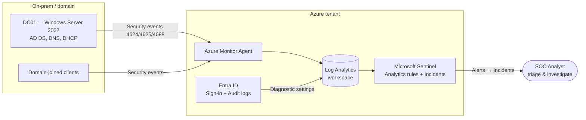

# 01 · SIEM & Detection Engineering Lab (Microsoft Sentinel)


> Stood up Microsoft Sentinel over a live Windows Active Directory + Entra ID environment,
> connected host and identity log sources, and authored detections for brute-force, anomalous
> sign-in, privilege escalation, and suspicious PowerShell — then validated them by simulating
> the attacks and triaging the resulting incidents.

## Objective

A security analyst's core loop is **collect → detect → triage → respond**. This project builds
that loop end-to-end in a real environment: get the right logs into a SIEM, write detections that
fire on attacker behavior (not noise), and prove they work by generating the activity and working
the resulting alerts like a Tier-1 analyst would.

## Environment / Tools

| Component | Detail |
|---|---|
| SIEM | **Microsoft Sentinel** (on a Log Analytics workspace) |
| Identity | **Entra ID** tenant (`admintradeproof.onmicrosoft.com` lab) |
| Endpoints | **Windows Server 2022** domain controller (DC01) + domain-joined Windows clients |
| Telemetry | Azure Monitor Agent (AMA) → Windows Security Events; Entra **SigninLogs** + **AuditLogs** |
| Query language | **KQL** (Kusto Query Language) |
| Framework | **MITRE ATT&CK** for detection mapping |

## Architecture



## What I did

1. Created a Log Analytics workspace and enabled Microsoft Sentinel on it.
2. Connected data sources:
   - **Windows Security Events via AMA** from DC01 and clients (logon, process-creation auditing).
   - **Entra ID** sign-in and audit logs via diagnostic settings.
3. Authored four analytics rules (below), each mapped to a MITRE ATT&CK technique and tuned to
   reduce false positives (thresholds, time windows, allow-lists for known admin hosts).
4. Simulated each attack from a test client to generate real telemetry.
5. Triaged the resulting incidents in Sentinel — reviewed entities, built a timeline, and wrote a
   short analyst summary for each (what fired, what it means, recommended action).

## Detections

> KQL below is illustrative of the deployed rules; see [`BUILD-GUIDE.md`](BUILD-GUIDE.md) for the
> full rule configuration (severity, scheduling, entity mapping).

**1. Password brute force followed by success — `T1110`**
```kql
let failures = SecurityEvent
    | where EventID == 4625
    | summarize Failures = count() by TargetAccount, Window = bin(TimeGenerated, 10m);
let successes = SecurityEvent
    | where EventID == 4624
    | summarize FirstSuccess = min(TimeGenerated) by TargetAccount, Window = bin(TimeGenerated, 10m);
failures
| where Failures >= 10
| join kind=inner (successes) on TargetAccount, Window
| project Window, TargetAccount, Failures, FirstSuccess
```

**2. Anomalous Entra sign-in / impossible travel — `T1078`**
```kql
SigninLogs
| where ResultType == 0
| project TimeGenerated, UserPrincipalName, IPAddress,
          Country = tostring(LocationDetails.countryOrRegion)
| order by UserPrincipalName asc, TimeGenerated asc
| serialize
| extend PrevUser = prev(UserPrincipalName), PrevCountry = prev(Country), PrevTime = prev(TimeGenerated)
| where UserPrincipalName == PrevUser and Country != PrevCountry
| extend MinutesApart = datetime_diff('minute', TimeGenerated, PrevTime)
| where MinutesApart <= 60
```

**3. New member added to a privileged role — `T1098`**
```kql
AuditLogs
| where OperationName == "Add member to role"
| extend Role = tostring(TargetResources[0].displayName)
| where Role has_any ("Global Administrator", "Privileged Role Administrator", "Security Administrator")
| project TimeGenerated,
          InitiatedBy = tostring(InitiatedBy.user.userPrincipalName),
          Role,
          Target = tostring(TargetResources[0].userPrincipalName)
```

**4. Suspicious / encoded PowerShell — `T1059.001`**
```kql
SecurityEvent
| where EventID == 4688
| where NewProcessName endswith "powershell.exe" or NewProcessName endswith "pwsh.exe"
| where CommandLine has_any ("-enc", "-EncodedCommand", "-w hidden", "DownloadString", "FromBase64String", "IEX")
| project TimeGenerated, Computer, Account, NewProcessName, CommandLine
```

## Skills demonstrated

- SIEM deployment and log-source onboarding (Microsoft Sentinel, Log Analytics, AMA)
- Detection engineering in **KQL** with false-positive tuning
- Mapping detections to **MITRE ATT&CK** techniques
- Identity-threat detection using **Entra ID** sign-in and audit logs
- Alert triage and incident investigation (entities, timeline, analyst write-up)
- Windows security auditing (logon events 4624/4625, process creation 4688)

## Results / Evidence

> 🚧 Lab build in progress — capturing these as I complete each step (see BUILD-GUIDE):

- [ ] `assets/01-sentinel-overview.png` — Sentinel workspace + connected data connectors
- [ ] `assets/02-analytics-rules.png` — the four enabled analytics rules
- [ ] `assets/03-bruteforce-incident.png` — brute-force incident with mapped entities
- [ ] `assets/04-investigation-graph.png` — investigation graph for a triaged incident
- [ ] `assets/05-kql-hunt.png` — an ad-hoc KQL hunt returning the simulated activity

## Lessons learned

_(To fill in after the build — e.g., tuning thresholds to cut false positives, AMA vs. legacy MMA
onboarding, and why entity mapping matters for fast triage.)_

## Mapped to

- **CompTIA Security+ (SY0-701) — Domain 4, Security Operations:** monitoring & alerting, SIEM /
  log data analysis, and incident response activities.
- **MITRE ATT&CK:** T1110 (Brute Force), T1078 (Valid Accounts), T1098 (Account Manipulation),
  T1059.001 (PowerShell).

## Reproduce this lab

Step-by-step instructions: **[BUILD-GUIDE.md](BUILD-GUIDE.md)**
