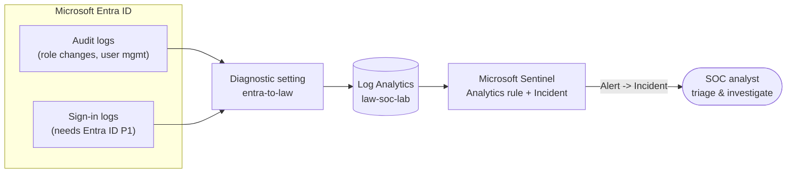

# 01 · SIEM & Detection Engineering Lab (Microsoft Sentinel)


> Stood up Microsoft Sentinel on a fresh Log Analytics workspace, streamed Entra ID identity logs
> into it, and wrote a detection that fires when someone is added to a sensitive directory role.
> Then I proved it works: elevated a test account and followed the event from raw log to triaged incident.

## Objective

Build the collect → detect → triage loop a SOC analyst actually works in, inside a live Azure tenant.
The detection targets one specific behavior: privilege escalation through a directory-role assignment,
where an attacker or insider quietly grants an account elevated rights. I wanted a rule that fires on
the real thing, not a toy example, so I validated it against a controlled simulation.

## Environment / Tools

| Component | Detail |
|---|---|
| SIEM | Microsoft Sentinel (managed in the Microsoft Defender portal) |
| Workspace | Log Analytics `law-soc-lab` (resource group `rg-soc-lab`, East US 2) |
| Identity source | Microsoft Entra ID, streamed via diagnostic setting `entra-to-law` (AuditLogs + SignInLogs) |
| Query language | KQL (Kusto Query Language) |
| Framework | MITRE ATT&CK |
| Test subject | `soc-test01`, a standard member account created for the lab |

## Architecture



## What I did

1. Created a resource group (`rg-soc-lab`) and a Log Analytics workspace (`law-soc-lab`), then enabled
   Microsoft Sentinel on it.
2. Connected the identity log source. Sentinel's Content hub now redirects to the Defender portal, so
   I onboarded Entra logs the supported way instead: a diagnostic setting (`entra-to-law`) that streams
   AuditLogs and SignInLogs into the workspace. Per Microsoft's docs, creating that diagnostic setting
   auto-enables the Sentinel Entra connector.
3. Created the test subject, `soc-test01`, a member account with no privileges.
4. Simulated the attack by adding `soc-test01` to two sensitive read-only roles, Global Reader and then
   Security Reader. Each one writes an "Add member to role" audit event, which is exactly what the
   detection looks for.
5. Validated the whole pipeline. I confirmed the event landed in the workspace with KQL, promoted that
   query to a scheduled analytics rule (built in the Defender portal, where Sentinel rule management
   lives now), and watched it raise a high-severity incident with `soc-test01` mapped as the entity.
   Then I cleaned up the duplicate alerts the 24-hour lookback was throwing.

## Detection: privileged role assignment (`T1098`)

Fires when an account is added to a sensitive directory role:

```kql
let sensitiveRoles = dynamic([
    "Global Administrator", "Privileged Role Administrator", "Security Administrator",
    "User Administrator", "Global Reader", "Security Reader"
]);
AuditLogs
| where OperationName == "Add member to role"
| mv-expand prop = TargetResources[0].modifiedProperties
| where tostring(prop.displayName) == "Role.DisplayName"
| extend RoleAdded = trim('"', tostring(prop.newValue))
| where RoleAdded in (sensitiveRoles)
| extend Actor = tostring(InitiatedBy.user.userPrincipalName),
         TargetUser = tostring(TargetResources[0].userPrincipalName)
| project TimeGenerated, RoleAdded, TargetUser, Actor, Result
| order by TimeGenerated desc
```

### What I'd add next
- Anomalous sign-in / impossible travel (`T1078`), from `SignInLogs`. Needs Entra ID P1.
- Brute force (`T1110`) and suspicious PowerShell (`T1059.001`). Both need a Windows log source, like a
  small Azure VM running the Azure Monitor Agent.

## Skills demonstrated

- Deploying Microsoft Sentinel and setting up a Log Analytics workspace
- Onboarding identity logs through Entra ID diagnostic settings (audit and sign-in)
- Writing detections in KQL: parsing `AuditLogs`, `mv-expand`, a role allow-list
- Mapping detections to MITRE ATT&CK (T1098)
- Running a controlled attack simulation and validating the full pipeline
- Identity and access basics: directory roles, least privilege

## Results / Evidence

> Screenshots captured to `C:\Users\jcade\Downloads\soc-lab-assets`, then copied into `assets/`.

- [x] `assets/01-sentinel-overview.png`: Sentinel enabled on `law-soc-lab`
- [x] `assets/02-entra-diagnostic-settings.png`: the `entra-to-law` setting pointed at `law-soc-lab`
- [x] `assets/03-role-assignment.png`: `soc-test01` granted Global Reader (the trigger)
- [x] `assets/04-kql-auditlog.png`: detection KQL returning the captured "Add member to role" event
- [x] `assets/05-analytics-rule.png`: the scheduled rule (Enabled, High, T1098) in the Defender portal
- [x] `assets/06-incident.png`: the resulting High incident with `soc-test01` mapped as the entity
- [x] `assets/07-investigation.png`: the incident's alert queue (Privilege Escalation) for triage

## Lessons learned

A few things I ran into building this:

- Sentinel moved into the Defender portal partway through. Both the Content hub and analytics-rule
  creation now redirect out of the Azure portal. You connect the workspace to Defender
  (System → Settings → Microsoft Sentinel), then build rules under Microsoft Sentinel → Configuration →
  Analytics. Log onboarding still happens through diagnostic settings. The thing that threw me: right
  after you connect a workspace, the Analytics page keeps bouncing back to workspace settings until
  onboarding propagates. That's normal, not a permissions problem, but it cost me a half hour of
  second-guessing.
- Lookback and run frequency interact in a way that makes noise. My rule ran every 5 minutes but looked
  back 24 hours, so every run re-found the same event and opened another alert. One incident, three
  alerts before I caught it. The fix is alert suppression: stop querying for 24 hours after a hit, so
  one event produces one alert.
- First-time ingestion is slow. Microsoft says data starts flowing within about 90 minutes and can take
  up to three days on first setup. Plan validation around that instead of expecting instant results.
- Sign-in logs need Entra ID P1; audit logs flow on any license, free included. The license gate is
  silent, so check which log types are actually arriving before you assume the pipeline is broken.
- Don't put credentials in a portfolio repo. The test account's password stays out of git, and the
  account gets deleted in cleanup. Basic hygiene, but it's the kind of thing a SOC review exists to catch.

## Mapped to

- CompTIA Security+ (SY0-701), Domain 4 (Security Operations): monitoring and alerting, SIEM and log
  analysis, incident response.
- MITRE ATT&CK: T1098 (Account Manipulation / privilege escalation). Next up: T1078, T1110, T1059.001.

## Reproduce this lab

Step-by-step instructions: [BUILD-GUIDE.md](BUILD-GUIDE.md)
