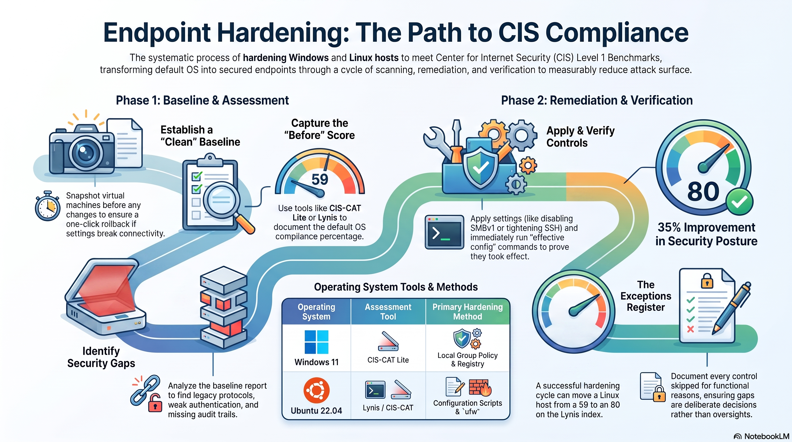

# 04 · Endpoint Hardening to CIS Benchmark

🎧 **Audio overview** (AI-generated, NotebookLM): [Hardening Ubuntu, 59 → 80](assets/audio-overview-endpoint-hardening.m4a)

> Take a default Windows 11 and Ubuntu 22.04 host to their CIS Level 1 baselines, scoring each before
> and after, and documenting every control I deliberately skip. **Ubuntu 22.04: Lynis 59 → 80.
> Windows 11: CIS-CAT Lite 22% → 74%.**

## Objective

A default OS ships for convenience, not safety: legacy protocols on, weak auth, almost nothing logged.
Hardening closes those gaps against a recognized baseline. The honest part is recording what I *didn't*
apply and why. This is the other side of [project 03](../03-vulnerability-management/) (which finds the
gaps) and the preventive half of [project 01](../01-siem-detection-lab/) (which detects the attack).

## Environment / Tools

| | Detail |
|---|---|
| Hosts | Windows 11, Ubuntu 22.04 LTS. Throwaway VMs (Linux on Azure), clean snapshot first |
| Benchmark | CIS Windows 11 / CIS Ubuntu 22.04, **Level 1** |
| Assessors | CIS-CAT Lite (Windows %), Lynis (Linux hardening index) |
| Apply (Linux) | drop-in configs + packages, one control group at a time, verified after each |
| Apply (Windows) | PowerShell registry + `secpol`/`secedit`, one control group at a time, verified by CIS-CAT rescan |

## Linux host: 8 control groups (59 → 80)

Worked one group at a time, proving each change with the matching verify command before moving on. Full
commands and gotchas in the [build guide](BUILD-GUIDE.md).

| # | Control group | Defends against | Verified with |
|---|---|---|---|
| 1 | SSH drop-in (`60-cis.conf`) | brute force, pivoting | `sshd -T` shows hardened values |
| 2 | `ufw` host firewall | open ports (FIRE-4512) | `ufw status` active, SSH allowed |
| 3 | fail2ban | brute force (bans the IP) | `fail2ban-client status sshd` |
| 4 | auditd + process accounting | no forensic trail | `auditctl -s` enabled |
| 5 | AIDE file integrity | tampering (89k files baselined) | 20M `aide.db` built |
| 6 | kernel `sysctl` (14 keys) | spoofing, DoS, memory exploits | `sysctl` shows ASLR, rp_filter |
| 7 | password policy + umask | weak, stale credentials | `pwquality.conf`, `login.defs` |
| 8 | attack-surface cleanup | unused drivers, no banner | banner, blacklist, rkhunter |

## Windows host: hardened by hand (22 to 74)

I meant to bulk-apply Microsoft's Windows 11 security baseline and be done in ten minutes. Then I read
what it actually does: its User Rights policy denies Remote Desktop logon to local accounts. This is a
remote-only VM. My account is a local account. That baseline would have locked me out of the one door in.

So, by hand. Six control groups first, one at a time, each verified before I moved on, same as the Linux
host. Then broader passes over the registry, `secedit`, services, and Defender, with a CIS-CAT rescan
after each round to prove the number was actually moving and not just that a file saved.

| # | Control group | Defends against | Verified with |
|---|---|---|---|
| 1 | Account and lockout policy | online password guessing | `net accounts` (length 14, lockout 5/15) |
| 2 | User Account Control | silent privilege elevation | `EnableLUA`, secure-desktop prompt |
| 3 | NTLMv2 only, block anonymous | credential relay, null-session recon | `LmCompatibilityLevel 5` |
| 4 | Remove SMBv1 | EternalBlue, WannaCry | `Get-WindowsOptionalFeature` Disabled |
| 5 | Windows Firewall, all profiles | unsolicited inbound | `Get-NetFirewallProfile` Block |
| 6 | Advanced audit policy | no forensic trail | `auditpol` Success and Failure |
| + | User Rights, services, MSS, printers, Defender ASR and real-time, event-log sizing, LAPS, RDP hardening | broad Level 1 coverage | CIS-CAT rescan, 22% to 74% |

The one that will bite you: don't flip a default-deny firewall, or the "Deny log on through RDP" right,
before you've explicitly allowed your own way in. Enable the Remote Desktop rule first. I kept the
RDP-deny at Guests only instead of Guests plus local accounts, which is why I can still reach the box.
Same lesson as "allow SSH before deny-all" on Linux, just a different door. The blow-by-blow, mistakes
left in, is in the [build walkthrough](assets/windows/walkthrough/00-BUILD-LOG.md).

## Exceptions (deliberately skipped, on the record)

| Control | Why |
|---|---|
| `kernel.modules_disabled` | blocks loading any module until reboot; too risky on a live host |
| `fs.protected_fifos=2` | Ubuntu's `99-protect-links.conf` resets it to 1 (sysctl drop-ins are last-wins) |
| GRUB password | single-user lab VM, no untrusted physical access |
| Separate `/home /tmp /var` partitions | single-disk lab VM; would partition on a real build |
| Remote logging | no external log host in the lab |
| Password policy | host uses SSH keys, so it is belt-and-suspenders here |

**Windows.** 101 still fail, and that's the interesting part, not an apology. Most a throwaway VM can't
physically satisfy, a few I skipped on purpose, the rest is newer stuff I chose not to chase:

| Group | ~Count | Why |
|---|---|---|
| BitLocker / TPM | ~18 | the VM has no physical TPM-backed disk; full-disk encryption is environmental, applied on real hardware |
| VBS / Credential Guard / Secure Launch | ~7 | configured by policy, but they activate on reboot, which I deferred on a throwaway VM |
| Deliberate safety choices | 3 | kept RDP reachable: the RDP-deny is scoped to Guests only, and the Public firewall can still merge the local RDP rule |
| New 24H2 SMB-audit / QUIC controls | ~13 | newer SMB client and server audit and rate-limiter settings, left for a follow-up pass |
| Long-tail admin templates / per-user (19.x) | ~60 | a mix of newer and per-user items, documented rather than chased for a single-user lab |

## Results / Evidence

| Host | Tool | Baseline | Hardened |
|---|---|---|---|
| Ubuntu 22.04 | Lynis index | **59** | **80** |
| Windows 11 | CIS-CAT Lite L1 | **22%** | **74%** |

**Linux** (done), in [`assets/linux/`](assets/linux/):
- [x] baseline 59: `cis-04-linux-lynis-baseline.png` + `cis-04-lynis-baseline.txt`
- [x] SSH before/after, firewall, fail2ban, auditd, AIDE: `cis-05-linux-{ssh-hardening-before,ssh-hardening-after,firewall,fail2ban,auditd,aide}.png`
- [x] sysctl proof `cis-05-linux-sysctl.txt`; `cis-05-linux-password-policy.png`; `cis-05-linux-attack-surface.png`
- [x] rescan 80: `cis-06-linux-lynis-rescan.png`

**Windows** (done), in [`assets/windows/`](assets/windows/):
- [x] baseline 22%: `cis-01-windows-baseline-scan.png`
- [x] hardening applied (account and lockout policy): `cis-02-windows-hardening.png`
- [x] rescan 74%: `cis-03-windows-rescan.png`
- [x] full build walkthrough, every step with the wrong turns left in: [`assets/windows/walkthrough/`](assets/windows/walkthrough/)

## Lessons learned

- **Verify, don't trust the happy message.** An SSH config that never saved looked identical to success.
  `sshd -T` (the effective config) caught it; a screenshot of "OK" would have shipped a false claim.
- **A benchmark isn't version-agnostic.** CIS's old `Protocol 2` directive now *errors* on Ubuntu
  22.04's OpenSSH. Apply controls against the OS in front of you.
- **`sysctl` drop-ins are last-wins; SSH config is first-wins.** File ordering decides which one applies.
- **Hardening tools add surface too.** AIDE pulled in Postfix (a mail server); the hardening move was
  to choose "Local only" rather than expose it.
- **The vendor baseline can lock you out.** Microsoft's Windows 11 baseline denies RDP to local accounts.
  On a remote-only box that isn't hardening, it's me locking myself out. So I did it by hand and left the
  deny at Guests only. That call is exactly what the exceptions register is for.
- **A green checkmark isn't proof.** A few of my registry writes went to the wrong key and did nothing at
  all, silently. I only caught it because the rescan didn't climb the way I expected. Trust the scan, not
  your own typing.
- **Exceptions are the deliverable.** The score is nice; the table of what you skipped and why is what a
  reviewer actually reads.

## Mapped to

- **CIS Controls v8, Control 4** (Secure Configuration). This project is Control 4.
- **CompTIA Security+ (SY0-701)** Domains 1 and 4; **A+** OS fundamentals.
- **MITRE ATT&CK (mitigations):** M1042 (remove SMBv1), M1027 (passwords), M1028 (OS config / sysctl),
  M1047 (auditd), raising the cost of T1110 (brute force), T1090 (pivoting), T1554 (tampering).

## Reproduce

Step by step: [BUILD-GUIDE.md](BUILD-GUIDE.md).
