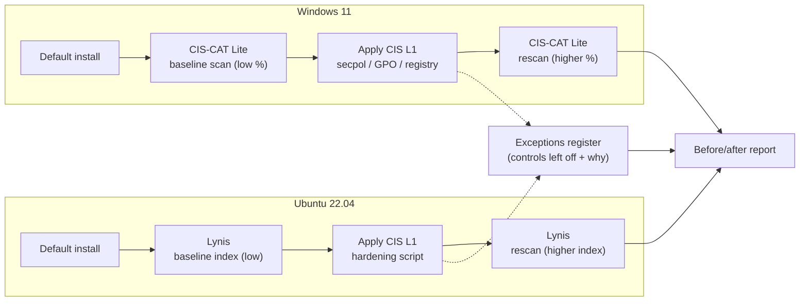

# 04 · Endpoint Hardening to CIS Benchmark


> Take a default Windows 11 host and a default Ubuntu 22.04 host and bring each to its CIS Benchmark
> Level 1 baseline. I scan each host before and after (CIS-CAT Lite on Windows, Lynis on Linux) so the
> improvement is a measured score, then write down every control I deliberately leave off, and why.
> The build guide is done and the lab's ready to run; I'm capturing the scan evidence now.

## Objective

A default operating system ships configured for convenience, not safety: legacy protocols on, weak
auth allowed, anonymous enumeration possible, almost nothing logged. Hardening is the unglamorous work
of closing those gaps against a recognized baseline so a host stops being easy. This project does that
to one Windows and one Linux machine, scores both before and after so the improvement is a number you
can point to, and writes down the controls I *didn't* apply and why. That last part, the documented
exceptions, is what separates a checkbox exercise from real work.

It's the other side of [project 03](../03-vulnerability-management/): vuln management finds the gaps,
hardening closes the configuration ones at the source. And it pairs with [project 01](../01-siem-detection-lab/):
there I detect the attack, here I make it harder to pull off in the first place.

## Environment / Tools

| Component | Detail |
|---|---|
| Windows host | Windows 11 (or Windows Server 2022), clean VM with a pre-change snapshot |
| Linux host | Ubuntu 22.04 LTS, clean VM with a pre-change snapshot |
| Benchmark | CIS Microsoft Windows 11 Enterprise Benchmark · CIS Ubuntu Linux 22.04 LTS Benchmark, **Level 1** |
| Windows assessor | CIS-CAT Lite (free) for before/after compliance score |
| Linux assessor | Lynis (free) for the before/after hardening index |
| Apply (Windows) | Local Security Policy / Local Group Policy / registry; Microsoft Security Compliance Toolkit + LGPO.exe as the bulk option |
| Apply (Linux) | A transparent hardening script (sshd, ufw, pwquality, sysctl, auditd, AIDE) |
| Safety | Throwaway VMs, snapshot rollback; CIS Build Kits not used (members-only) |

## Architecture



## What the lab does

1. **Snapshot first.** Both hosts get a clean snapshot before anything changes, so a setting that cuts
   the box off from the network is a one-click rollback. Hardening without a rollback path is how you
   turn a lab into a reinstall.
2. **Score the "before."** CIS-CAT Lite assesses the Windows host against the Windows 11 L1 profile and
   produces an overall compliance percentage; Lynis audits the Ubuntu host and produces a hardening
   index. A default install scores low on both. That's the starting line.
3. **Harden Windows to L1.** Account and lockout policy (14-char minimum, history, lockout after five
   tries), SMBv1 removed, NTLMv2-only with LM/NTLM refused, anonymous SAM/share enumeration restricted,
   UAC in admin-approval mode on the secure desktop, AutoPlay off, Guest disabled, the firewall on for
   every profile with default-inbound-block, and the high-value audit subcategories turned on. By hand
   through Local Security Policy and the registry, so I can see each control; the Microsoft Security
   Compliance Toolkit with LGPO.exe is the bulk route for doing it at scale.
4. **Harden Ubuntu to L1.** SSH locked down (no root login, fewer auth tries, no empty passwords, idle
   timeout), a `ufw` default-deny firewall, password quality and aging via `pwquality`/`login.defs`,
   `pam_faillock` lockout, kernel network hardening through `sysctl`, unused filesystems blacklisted,
   `auditd` and AIDE for logging and file integrity, and unattended security updates.
5. **Document the exceptions.** Every control I leave off gets a row: what it is, that I chose to skip
   it, and the reason (a VM with no TPM can't do BitLocker; RDP stays on with NLA because it's the only
   way into the lab box). A clean scan with undocumented gaps is worse than a lower scan you can explain.
6. **Score the "after."** Rescan both hosts with the same tools and profiles, and report the before/after
   delta side by side with the exception register.

## Key controls applied

A sample of the high-impact settings. The full set lives in the [build guide](BUILD-GUIDE.md).

**Windows (PowerShell / Local Security Policy):**

```powershell
net accounts /minpwlen:14 /lockoutthreshold:5 /lockoutduration:15 /uniquepw:24
Disable-WindowsOptionalFeature -Online -FeatureName SMB1Protocol -NoRestart   # kill legacy SMBv1
Set-ItemProperty 'HKLM:\SYSTEM\CurrentControlSet\Control\Lsa' LmCompatibilityLevel 5  # NTLMv2 only
Set-NetFirewallProfile -Profile Domain,Public,Private -Enabled True -DefaultInboundAction Block
```

**Linux (`/etc/ssh/sshd_config` + `sysctl`):**

```bash
PermitRootLogin no          # CIS 5.2: no direct root over SSH
MaxAuthTries 4
PermitEmptyPasswords no
# /etc/sysctl.d/60-cis.conf
net.ipv4.conf.all.accept_redirects = 0
kernel.randomize_va_space = 2   # full ASLR
```

> One detail worth flagging: the old CIS guidance to set `Protocol 2` in `sshd_config` will *break*
> SSH on Ubuntu 22.04: the directive was removed in OpenSSH 7.6+. SSHv1 is already gone by default, so
> the line is both unnecessary and an error. Following a benchmark blindly across OS versions bites you;
> you read it against the version in front of you.

## Skills demonstrated

- Reading and applying a CIS Benchmark (Windows 11 and Ubuntu 22.04, Level 1)
- Security baselines and configuration hardening across two operating systems
- Group Policy / Local Security Policy, the registry, and PowerShell on Windows
- Linux hardening: SSH, host firewall, PAM/password policy, `sysctl`, `auditd`, file integrity
- Compliance scanning and measuring improvement (CIS-CAT Lite, Lynis)
- Exception management: justifying and recording deviations instead of hiding them
- Change safety: snapshots and staged rollout so hardening can't strand a host

## Results / Evidence

> Lab built from the [build guide](BUILD-GUIDE.md); evidence capture is in progress. Scores below are
> filled from the actual CIS-CAT Lite and Lynis reports once the scans are captured. No numbers are
> claimed before the scan produces them.

| Host | Tool / profile | Baseline | Hardened |
|---|---|---|---|
| Windows 11 | CIS-CAT Lite · Windows 11 L1 | _pending scan_ | _pending scan_ |
| Ubuntu 22.04 | Lynis hardening index | _pending scan_ | _pending scan_ |

- [ ] `assets/cis-01-windows-baseline-scan.png`: CIS-CAT Lite Windows score before hardening
- [ ] `assets/cis-02-windows-gpo-settings.png`: applying L1 settings (password/lockout policy or SMBv1 removed)
- [ ] `assets/cis-03-windows-rescan.png`: CIS-CAT Lite Windows score after hardening
- [ ] `assets/cis-04-linux-lynis-baseline.png`: Lynis hardening index before
- [ ] `assets/cis-05-linux-hardening-script.png`: the hardening script running / `sshd_config` diff
- [ ] `assets/cis-06-linux-lynis-rescan.png`: Lynis hardening index after
- [ ] `assets/cis-07-exceptions-register.png`: the documented exceptions and before/after summary

## Lessons learned

> Filled in as I run the lab. Early notes from building the guide:

- A benchmark isn't version-agnostic. The `Protocol 2` directive that CIS once recommended now errors on
  Ubuntu 22.04's OpenSSH. Apply a control against the OS in front of you, not the PDF in the abstract.
- The free tier covers the skill, not the convenience. CIS-CAT Lite and the Benchmark PDFs are free, but
  the ready-made remediation GPOs (CIS Build Kits) need a paid SecureSuite membership. Applying L1 by
  hand through Local Security Policy is slower and teaches you far more than importing someone's GPO.
- Exceptions are the real deliverable. The score going up is nice, but the table of what you left off,
  and why, is the part a hardening review actually reads.

## Mapped to

- **CIS Controls v8, Control 4 (Secure Configuration of Enterprise Assets and Software).** This project
  *is* Control 4: establish, apply, and maintain a secure baseline, measured against the CIS Benchmarks.
- **CompTIA Security+ (SY0-701):** Domain 1 (secure baselines, hardening targets) and Domain 4 (Security
  Operations: hardening, configuration enforcement, Group Policy). Endpoint OS hardening also maps back
  to **A+** fundamentals.
- **MITRE ATT&CK (the mitigation side):** M1042 Disable or Remove Feature or Program (SMBv1), M1027
  Password Policies, M1028 Operating System Configuration (sysctl, anonymous restrictions), M1018 User
  Account Management (Guest disabled), M1047 Audit (audit policy, auditd). These raise the cost of
  T1021.002 (SMB/Windows Admin Shares), T1110 (Brute Force, via lockout), and T1078 (Valid Accounts).

## Reproduce this lab

Step-by-step instructions: [BUILD-GUIDE.md](BUILD-GUIDE.md)
