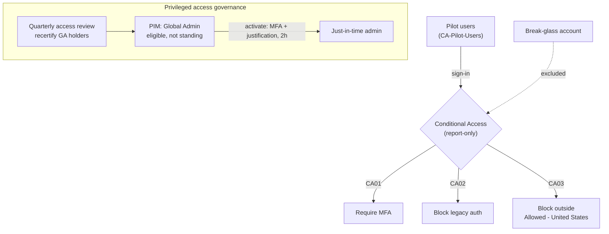

# 06 · Identity & Access Management on Entra ID

> Hardened a live Microsoft Entra ID tenant: Conditional Access (require MFA, block legacy auth,
> geo-fence sign-ins), just-in-time admin access with PIM, and a recurring access review. I built it
> the way you'd touch a real tenant, scoped to a pilot group with a break-glass account left out of
> every policy so a mistake couldn't lock me out.

## Objective

Most cloud intrusions start with a compromised identity, so this project builds the controls that make
an account hard to abuse: strong authentication, no standing admin rights, and a recurring check on who
holds privileged roles. It's the other side of [project 01](../01-siem-detection-lab/). There I detect
a privileged-role assignment (MITRE T1098); here I make that escalation much harder to pull off in the
first place.

## Environment / Tools

| Component | Detail |
|---|---|
| Directory | Microsoft Entra ID (tenant `admintradeproof.onmicrosoft.com`), Entra ID P2 |
| Access control | Conditional Access, run in report-only as a pilot |
| Privileged access | Privileged Identity Management (PIM) for Entra roles |
| Governance | Access reviews (recurring recertification) |
| Safety | a dedicated break-glass account, excluded from every policy |
| Pilot scope | security group `CA-Pilot-Users` (one non-privileged test account) |

## Architecture

## What I did

1. Set up a safe way to roll this out first. I made a pilot group (`CA-Pilot-Users`), scoped every
   Conditional Access policy to it, and excluded the break-glass account from all of them. The policies
   run in report-only, so they log what they *would* have done without actually blocking anyone. That's
   how you test access policy without locking yourself out, and it's the step people skip.
2. CA01, require MFA. Pilot users have to complete MFA to reach any resource.
3. CA02, block legacy authentication. Legacy clients (Exchange ActiveSync, plus the "Other clients"
   bucket: POP, IMAP, SMTP, old Office) skip MFA entirely, so blocking them closes one of the easiest
   ways in.
4. CA03, geo-fence. I created a named location for the United States and a policy that blocks sign-ins
   from anywhere else.
5. PIM, just-in-time Global Admin. I set the Global Administrator role so activating it requires MFA and
   a written justification and expires after two hours, then made the test account *eligible* instead of
   permanently assigned. The account now holds no admin rights until it activates them, for a limited
   window, with a record of why. That fixes the standing-admin problem I'd flagged earlier on this tenant
   (three permanent Global Admins).
6. Access review. I set up a quarterly review of who holds Global Administrator (eligible and active),
   with an admin as the reviewer and results applied automatically. Privileged access gets re-checked on
   a schedule instead of just piling up.

## Skills demonstrated

- Entra ID administration: users, security groups, directory roles
- Conditional Access design: MFA, blocking legacy auth, location conditions
- Phased, report-only rollout with a break-glass exclusion (change management that won't lock you out)
- Privileged Identity Management: just-in-time activation, eligible vs. standing assignments, activation
  requirements (MFA, justification, time limit)
- Access reviews and periodic recertification of privileged roles
- Least-privilege and Zero Trust applied to a live tenant

## Results / Evidence

> Screenshots captured to `C:\Users\jcade\Downloads\iam-lab-assets`, then copied into `assets/`.

- [x] `assets/iam-01-create-user.png`: provisioning a user in Entra ID
- [x] `assets/iam-02-pilot-group.png`: the `CA-Pilot-Users` group with its test member
- [x] `assets/iam-03-ca-require-mfa.png`: CA01 require MFA (report-only, break-glass excluded)
- [x] `assets/iam-04-ca-block-legacy.png`: CA02 block legacy authentication
- [x] `assets/iam-05-named-location.png`: the `Allowed - United States` named location
- [x] `assets/iam-06-ca-geo-block.png`: CA03 block access outside the allowed location
- [x] `assets/iam-07-pim-role-settings.png`: PIM Global Admin set to 2h activation with MFA + justification
- [x] `assets/iam-08-pim-eligible.png`: the test account eligible for Global Administrator, not standing
- [x] `assets/iam-09-access-review.png`: the quarterly Global Administrator access review

## Lessons learned

- Pilot, report-only, and a break-glass account aren't optional. Turning on "require MFA for everyone"
  or pulling standing admin rights without a tested exclusion is how people lock themselves out of a
  tenant for real. Running report-only against a pilot group shows you the blast radius before anything
  blocks a user, and the break-glass account is your way back in if a policy misbehaves.
- Eligible isn't the same as active, and that's the whole point of PIM. A Global Admin can be eligible,
  with zero standing power, and only become active through a logged, MFA-gated, time-boxed activation.
  Standing admin accounts show up in nearly every access review; this is the fix.
- The portal keeps moving. Conditional Access renamed "cloud apps" to "Resources (formerly cloud apps)."
  And the PIM access-review Overview shows "Scope: Everyone / Role: ---" even when it's correctly scoped
  to one role, which had me second-guessing a setup that was actually fine. The create form is the
  source of truth, not that summary pane.
- The controls worth having cost money. Conditional Access, PIM, and access reviews all need Entra ID P1
  or P2. On the free tier you only get RBAC, groups, and Security Defaults.

## Mapped to

- CompTIA Security+ (SY0-701), Domains 4 and 5: identity and access management, MFA, conditional access,
  least privilege, privileged access management, access recertification.
- MITRE ATT&CK (the preventive side): raises the cost of T1078 (Valid Accounts) through MFA, geo, and
  legacy-auth blocking, and T1098 (Account Manipulation) through just-in-time admin and access reviews.
  T1098 is the technique I detect in project 01.

## Reproduce this lab

Step-by-step instructions: [BUILD-GUIDE.md](BUILD-GUIDE.md)
