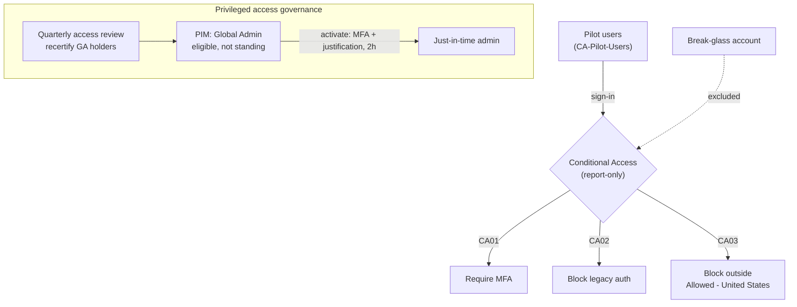

# 06 · Identity & Access Management on Entra ID

> Hardened identity in a live Microsoft Entra ID tenant: phased **Conditional Access** (require MFA,
> block legacy auth, geo-fence), **just-in-time privileged access** with **PIM**, and a recurring
> **access review** — built the safe way, scoped to a pilot group with a break-glass exclusion.

## Objective

Identity is the primary attack surface in the cloud. This project builds the defender's identity
controls end to end: enforce strong authentication, eliminate standing admin rights, and put
privileged access on a recurring recertification cycle. It's the **prevent** half of the identity
story whose **detect** half is the [SIEM lab (project 01)](../01-siem-detection-lab/) — there I
catch a privileged-role assignment (MITRE T1098); here I make that escalation far harder to achieve.

## Environment / Tools

| Component | Detail |
|---|---|
| Directory | **Microsoft Entra ID** (tenant `admintradeproof.onmicrosoft.com`), **Entra ID P2** |
| Access control | **Conditional Access** (report-only pilot) |
| Privileged access | **Privileged Identity Management (PIM)** — Microsoft Entra roles |
| Governance | **Access reviews** (recurring recertification) |
| Safety | dedicated **break-glass** emergency account, excluded from all policies |
| Pilot scope | security group `CA-Pilot-Users` (member: a non-privileged test account) |

## Architecture

## What I did

1. **Established a safe rollout pattern.** Created a pilot security group (`CA-Pilot-Users`) and
   scoped every Conditional Access policy to it, with the **break-glass emergency account excluded**
   from all of them. All CA policies were created in **report-only** so they log what *would* happen
   without risking a lockout — the same phased approach a real org uses.
2. **CA01 — Require MFA.** Pilot users must complete multifactor authentication for all resources.
3. **CA02 — Block legacy authentication.** Blocked legacy clients (Exchange ActiveSync + "Other
   clients" — POP/IMAP/SMTP/older Office) that bypass MFA entirely. This is one of the highest-impact
   identity controls available.
4. **CA03 — Geo-fence.** Created a named location **`Allowed - United States`** and a policy that
   blocks access from **any location except** the trusted one.
5. **PIM — just-in-time Global Administrator.** Configured the Global Administrator role so activation
   requires **Azure MFA + a justification** and expires after **2 hours**, then set the test account as
   **Eligible** (not a standing assignment). This directly remediates the "standing Global Admins"
   anti-pattern — admin rights now exist only on demand, for a bounded window, with an audit trail.
6. **Access review.** Created a **quarterly** review of **Global Administrator** assignments (eligible
   and active), with an admin reviewer and auto-apply on completion — so privileged access is
   recertified on a cycle instead of accumulating silently.

## Skills demonstrated

- Microsoft Entra ID administration (users, security groups, directory roles)
- **Conditional Access** policy design — MFA enforcement, legacy-auth blocking, location conditions
- **Phased/report-only rollout** and **break-glass** exclusion (lockout-safe change management)
- **Privileged Identity Management** — just-in-time activation, eligible vs. standing assignments,
  activation requirements (MFA, justification, time-bound)
- **Identity governance** — access reviews / periodic recertification of privileged roles
- Least-privilege and Zero Trust principles applied to a live tenant

## Results / Evidence

> Screenshots captured to `C:\Users\jcade\Downloads\iam-lab-assets`, then copied into `assets/`.

- [x] `assets/iam-01-create-user.png` — provisioning a user in Entra ID
- [x] `assets/iam-02-pilot-group.png` — `CA-Pilot-Users` security group with its test member
- [x] `assets/iam-03-ca-require-mfa.png` — **CA01** Require MFA (report-only, break-glass excluded)
- [x] `assets/iam-04-ca-block-legacy.png` — **CA02** Block legacy authentication
- [x] `assets/iam-05-named-location.png` — named location `Allowed - United States`
- [x] `assets/iam-06-ca-geo-block.png` — **CA03** block access outside the allowed location
- [x] `assets/iam-07-pim-role-settings.png` — PIM Global Admin: 2h activation, MFA + justification
- [x] `assets/iam-08-pim-eligible.png` — test account **Eligible** for Global Administrator (not standing)
- [x] `assets/iam-09-access-review.png` — quarterly access review of Global Administrator

## Lessons learned

- **Pilot + report-only + break-glass is non-negotiable.** Enforcing "require MFA for all users" or
  removing standing admin without a tested exclusion is exactly how admins lock themselves out of a
  tenant. Scoping to a pilot group and running report-only first proves a policy's impact before it
  blocks anyone — and the break-glass account is the safety net if a policy misfires.
- **Eligible ≠ active.** PIM's value is that a Global Admin assignment can be *eligible* (zero standing
  power) and only become active through a logged, MFA-gated, time-boxed activation. Standing admin
  accounts are a top finding in any identity review; JIT is the fix.
- **The portal moved.** Microsoft renamed Conditional Access's "cloud apps" to **"Resources (formerly
  cloud apps) → All resources."** The PIM role access-review **Overview** also cosmetically shows
  *Scope: Everyone / Role: ---* even when correctly scoped to a single role — the configuration
  (Role = Global Administrator) is the source of truth, not that summary pane.
- **Licensing gates the good controls.** Conditional Access, PIM, and access reviews require
  **Entra ID P1/P2**; only RBAC, groups, and Security Defaults work on the free tier.

## Mapped to

- **CompTIA Security+ (SY0-701) — Domain 4 (Security Operations) & Domain 5 (Governance):** identity
  & access management, MFA, conditional access, least privilege, privileged access management,
  access recertification.
- **MITRE ATT&CK (preventive):** raises the cost of **T1078 Valid Accounts** (MFA + geo + legacy-auth
  block) and **T1098 Account Manipulation / privilege escalation** (JIT admin + access reviews) — the
  behavior detected in [project 01](../01-siem-detection-lab/).

## Reproduce this lab

Step-by-step instructions: **[BUILD-GUIDE.md](BUILD-GUIDE.md)**
